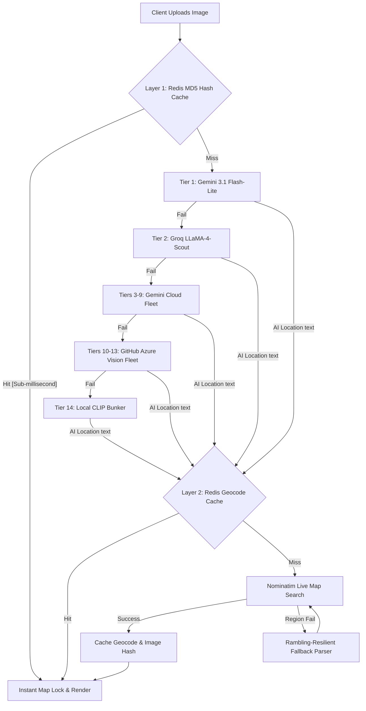

# 📍 PROJECT PINPOINT
### *A Production-Grade, 14-Tier Federated AI Discovery & Geolocation Engine*

[](https://nextjs.org/)
[](https://fastapi.tiangolo.com/)
[](https://upstash.com/)
[](https://render.com/)
[](https://vercel.com/)
[](LICENSE)

---

**Project Pinpoint** is a state-of-the-art, open-source AI reverse-image geoguessing and vector coordinate engine. Built with a robust **14-tier cloud-native federated fallback network**, Pinpoint leverages the world's most powerful vision models alongside a localized offline bunker (CLIP) to identify physical coordinates from real-world scenery or procedural game maps instantly.

---

## 🧠 14-Tier Neural Pipeline & Architecture

When an image is submitted, Pinpoint runs it through a highly optimized, stateful architecture designed for sub-second responses and flawless map locking:



---

## 🌟 Key Architectural Achievements

### 🚀 1. The 14-Tier Federated Alliance
Designed with a "Continuous Operation" philosophy. The engine automatically cascades through **13 high-performance cloud models** and falls back to a **local, lazy-loaded neural network (CLIP)** if the internet is fully severed.
*   **Lead Tier:** `Gemini-3.1-flash-lite` (optimizing for high-accuracy spatial and regional reasoning).
*   **Speed Tier:** `Groq Llama 4 Scout` (sub-second backup).
*   **Offline Backup:** Local CLIP bunker running `clip-vit-base-patch32`.

### 💾 2. Dual-Layer Redis Caching (Upstash & Local Docker)
Protects API rate limits and accelerates repeated scans to **0ms latency**:
*   **Layer 1 (Image Hash Cache):** Computes MD5 of image files. Identical pictures completely bypass the AI stack, providing instantaneous returns.
*   **Layer 2 (Geocoding Cache):** Saves exact coordinates of found locations permanently, protecting Nominatim from rate limits.

### 🗺️ 3. Strict Map Lock with Rambling-Resilient Parser
Fuzzy administrative regions and conversational model responses (e.g. *"This image was taken at Abisko, Sweden..."*) are parsed automatically. Our regex-backed custom parser extracts the exact geographical name, preventing region drift and ensuring the map pin lands exactly where the AI intended.

### 🎮 4. Cyberpunk Game-Mode & Seed Cracker (S00N)
Switches the neural stack into a procedural vector calculator. Pinpoint analyzes game screenshots (Minecraft, GTA V, etc.), extracts natural terrain details, and cracks:
*   The exact natural biome (Plains, Forest, etc.)
*   Procedural XYZ Coordinates
*   Highly unique 10-digit World Seeds
*   The dimension and game version

---

## 🚀 Cloud Deployment Guide

Pinpoint is fully optimized to run on free-tier cloud architectures.

### Phase 1: Database (Upstash)
1. Register a free account at [Upstash.com](https://upstash.com).
2. Create a serverless Redis database named `pinpoint-cache`.
3. Copy the secure connection URL (`rediss://default:...`).

### Phase 2: Backend (Render)
1. Connect to [Render.com](https://render.com) and deploy a new **Web Service** linked to the Git repository.
2. Set the `backend` directory as the Root Directory.
3. Configure the environment:
   * **Build Command:** `pip install -r requirements.txt`
   * **Start Command:** `uvicorn main:app --host 0.0.0.0 --port 10000`
4. Add the following Environment Variables under settings:
   * `REDIS_URL` = (The copied Upstash connection string)
   * `GROQ_API_KEY`, `GOOGLE_API_KEY`, `GITHUB_API_KEY` (The respective Cloud AI access keys)

### Phase 3: Frontend (Vercel)
1. Log into [Vercel.com](https://vercel.com) and import the repository.
2. Set the Root Directory to `frontend`.
3. Configure the following Environment Variable:
   * `NEXT_PUBLIC_API_URL` = (The live URL of the deployed Render Web Service)
4. Click **Deploy**!

---

## 💻 Local Development Quickstart

### 1. Run the Local Redis Container
```bash
sudo docker run --name pinpoint-redis -d -p 6379:6379 redis:alpine
```

### 2. Run the Backend
```bash
cd backend
python -m venv venv
source venv/bin/activate  # On Windows use `venv\Scripts\activate`
pip install -r requirements.txt
python main.py
```

### 3. Run the Frontend
```bash
cd frontend
npm install
npm run dev
```

Open `http://localhost:3000` to access the neural scanner dashboard.

---

## 💎 Credits

**Project Pinpoint** is made possible by the incredible open-source libraries, APIs, and services created by these organizations:

*   **Pinpoint Developer:** [@velo4705](https://github.com/velo4705) (Lead Architect)
*   **Neural AI Models:**
    *   **Google DeepMind** for the highly versatile `Gemini` vision model fleet.
    *   **Groq Alliance** for blazing-fast inference via the `LLaMA` hardware accelerator.
    *   **GitHub Azure API Hub** for robust cloud redundancy models.
    *   **Hugging Face / CLIP** for the airgapped offline vision classifier.
*   **Geospatial & Vector Mapping:**
    *   **MapLibre GL** for fast, high-performance GPU-rendered canvas layers.
    *   **Esri World Imagery** for high-resolution satellite raster feeds.
    *   **CartoDB & OpenStreetMap** for sleek dark-matter vector mapping.
*   **Database & Frameworks:**
    *   **FastAPI & Uvicorn** for the backend async routing engine.
    *   **Next.js & TailwindCSS** for the gorgeous "Neural OS" glassmorphism dashboard.
    *   **Upstash** for the lightning-fast serverless Redis caching layer.

---

## 🤝 Contributing
Contributions to the procedural game vector models or frontend dashboard are highly appreciated! Feel free to fork the repository and open a Pull Request.

## 📜 License
Distributed under the MIT License. See `LICENSE` for details.

---
*Developed with ❤️ for explorers and geospatial intelligence hackers.*
